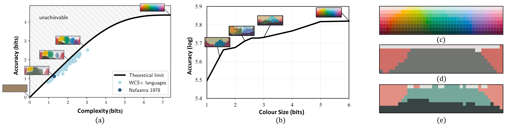
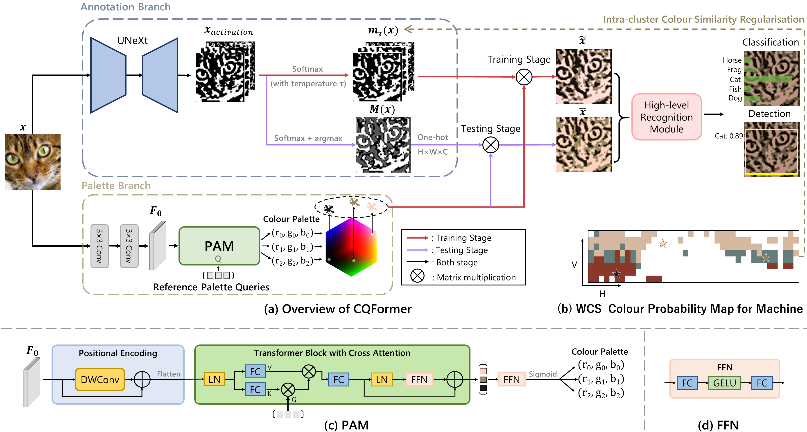

# Name Your Colour For the Task: Artificially Discover Colour Naming via Colour Quantisation Transformer

**2023.7.14: Papar is accepted by ICCV 2023 Oral !** 

Some of the code are borrow from [ColorCNN](https://github.com/hou-yz/color_distillation) and [IAT](https://github.com/cuiziteng/Illumination-Adaptive-Transformer), thanks them so much!
The code of Colour Evolution will be released soon~

If this code or paper help you, please cite as follow, thx~

```
@article{su2022name,
  title={Name Your Colour For the Task: Artificially Discover Colour Naming via Colour Quantisation Transformer},
  author={Su, Shenghan and Gu, Lin and Cui, Ziteng and Yang, Yue and Shen, Jingjing and Yamane, Hiroaki and Zhang, Zenghui and Harada, Tatsuya},
  journal={arXiv preprint arXiv:2212.03434},
  year={2022}
}
```


## Abstract
The long-standing theory that a colour-naming system evolves under dual pressure of efficient communication and perceptual mechanism is supported by more and more linguistic studies, including analysing  four decades of diachronic data from the Nafaanra language. This inspires us to explore whether machine learning could evolve and discover a similar colour-naming system via optimising the communication efficiency represented by high-level recognition performance. Here, we propose a novel colour quantisation transformer, CQFormer, that quantises colour space while maintaining the accuracy of machine recognition on the quantised images. Given an RGB image, Annotation Branch maps it into an index map before generating the quantised image with a colour palette; meanwhile the Palette Branch utilises a key-point detection way to find proper colours in the palette among the whole colour space. By interacting with colour annotation,  CQFormer is able to balance both the machine vision accuracy and colour perceptual structure such as distinct and stable colour distribution for discovered colour system. Very interestingly, we even observe the consistent evolution pattern between our artificial colour system and basic colour terms across human languages. Besides, our colour quantisation method also offers an efficient quantisation method that effectively compresses the image storage while maintaining high performance in high-level recognition tasks such as classification and detection. Extensive experiments demonstrate the superior performance of our method with extremely low bit-rate colours, showing potential to integrate into quantisation network to quantities from image to network activation. 

<!--  -->
<div align="center">
  
</div>
<p>
  Figure 1: (a) the theoretical limit of efficiency for colour naming (black curve) and  cases of the WCS probability map of human colour language copied from Zaslavsky et al. (b) the colour size (from 1-bit to 6-bit)-accuracy curve on the tiny-imagenet-200 (Le et al}) dataset. The WCS probability maps generated by our CQFormer are also shown along the curve. (c)  the colour naming stimulus grid used in the WCS(Kay et al). (d) the three-term WCS probability map of CQFormer after embedding 1978 Nafaanra three-colour system (light ('fiNge'), dark ('wOO'), and warm or red-like ('nyiE')) into the latent representation. (e) the four-term WCS probability map of CQFormer evolved from (d). The evolved fourth colour, yellow-green, is consistent with the prediction of basic colour term theory (Berlin et al.)
</p>

## Model Structure:


<div align="center">
  
</div>
<p align="center">
  Figure 2: Model Structure of CQFormer.
</p>

CQFormer consists of two main branches: (1) Annotation Branch, which assigns a quantised colour index to each pixel of the input RGB image, and (2) Palette Branch, which is  responsible for generating a suitable colour palette.

<br/>

## Usage:


```
$ conda env create -f environment.yml
```

<br/>

## Visualise:
<div align="center">
  
</div>
<p align="center">
  Figure 3: 8-colour quantised images by CQFomer..
</p>
